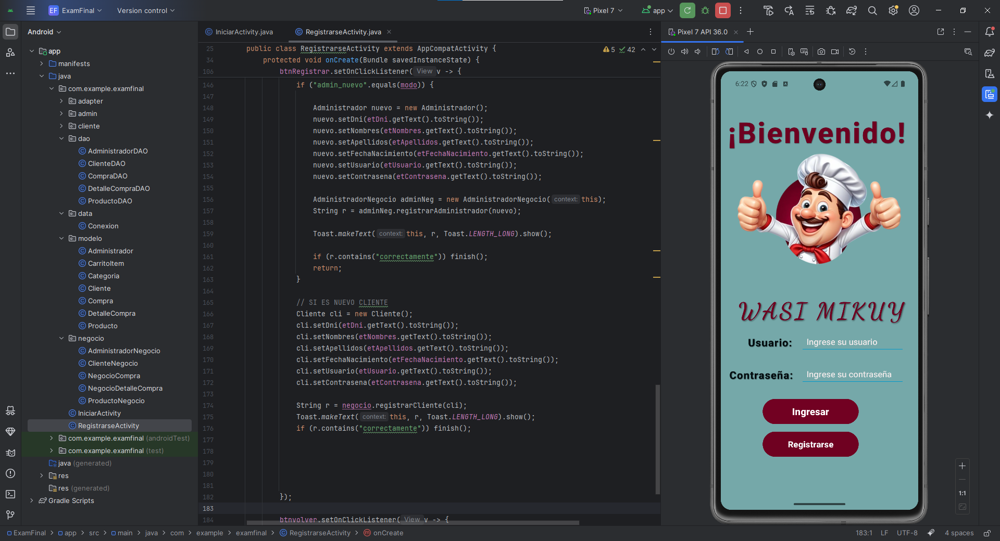
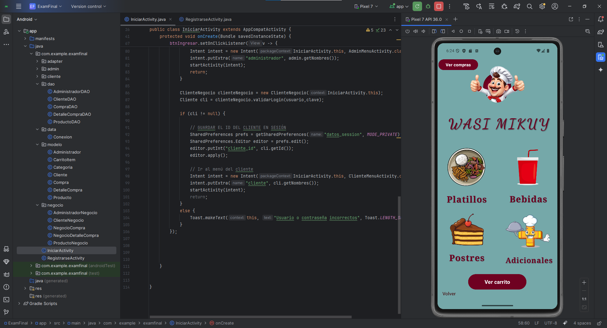
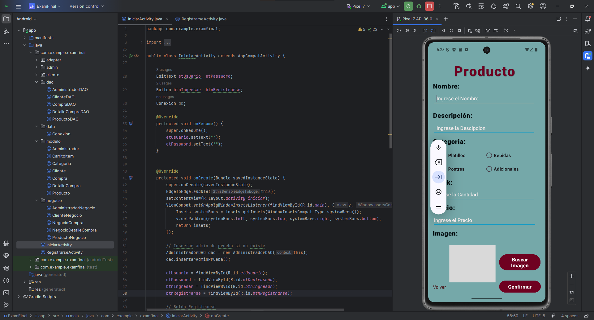

# Sistema de Pedidos Android

Aplicación móvil desarrollada en Android Studio que permite gestionar pedidos mediante el uso de SQLite como base de datos local. El sistema cuenta con autenticación diferenciada para administradores y clientes, permitiendo distintas funcionalidades según el tipo de usuario.

---

## Tecnologías
* Java 
* Android Studio
* SQLite
* XML (Layouts)
* Arquitectura básica por capas

---

## Funcionalidades

* Login de administrador
* Login de cliente
* Registro de productos
* Gestión de productos
* Visualización de pedidos
* Persistencia de datos con SQLite
* Interfaces dinámicas con Android UI

---

## Tipos de Usuario

* Administrador:

  * Gestión de productos
  * Visualización de pedidos

* Cliente:

  * Registro de pedidos
  * Consulta de productos
  * Pago de platillos

---

## Base de Datos

El sistema utiliza SQLite como base de datos local en el dispositivo móvil.

---

## Ejecución

1. Clonar el repositorio
2. Abrir el proyecto en Android Studio
3. Ejecutar en emulador o dispositivo físico

---

## Capturas del Sistema

### Login

### Menú Principal

### Registro de productos

---

